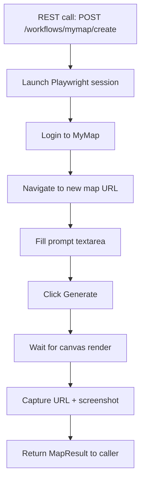

# comet-agent — Architecture Overview

## System purpose

Comet Agent is a browser automation API server that enables programmatic control of web interfaces. Its primary use case is driving the MyMap AI canvas to create, populate, and export visual knowledge maps as part of the GlacierEQ APEX operational ecosystem.

---

## Layer diagram

```
┌─────────────────────────────────────────────────────┐
│                   Express REST API                   │
│          /browser  /workflows  /tools  /jobs         │
├─────────────────────────────────────────────────────┤
│              BrowserProvider Interface               │
│     src/browser/BrowserProvider.ts                   │
│     src/browser/providerFactory.ts                   │
├───────────────────┬─────────────────────────────────┤
│  PlaywrightProvider│     StagehandAdapter            │
│  (deterministic)   │     (NL-resilient)              │
│  Default engine    │     Optional — needs OpenAI key │
├───────────────────┴─────────────────────────────────┤
│              Workflow Modules                        │
│   src/workflows/mymap/      First-class MyMap tasks  │
│   src/workflows/github/     GitHub browser tasks     │
│   src/workflows/notion/     Notion browser tasks     │
├─────────────────────────────────────────────────────┤
│           Contracts (Zod — single validator)         │
│           src/contracts/                             │
├─────────────────────────────────────────────────────┤
│         Prisma (Postgres) + Redis + Winston          │
└─────────────────────────────────────────────────────┘
```

---

## Engine selection

| Engine | When to use | Key trait |
|---|---|---|
| Playwright (default) | Stable, known UI selectors | Deterministic, fast, debuggable |
| Stagehand | Fragile or changing UI | Natural-language resilience |

Set `BROWSER_PROVIDER` in `.env` to switch without code changes.

---

## MyMap workflow — golden paths



---

## Provider interface pattern

All app code imports from `src/browser/BrowserProvider.ts` only — never from a specific engine. This means:
- Swapping Playwright → Stagehand requires only an env var change
- Both engines implement identical method signatures
- Tests can mock the provider interface without spinning up a browser

---

## Validation strategy

All request/response validation uses **Zod only** (Joi removed). Zod keeps runtime validation aligned with TypeScript type inference — one schema, one type, no drift.

---

## Session lifecycle

```
launch(sessionId?) → navigate() → act() / extract() → screenshot() → close()
```

Sessions are managed by `SessionManager.ts`. In production, configure Redis for session state persistence across restarts.

---

## Port

Default: **8787**. Set `PORT` env var to override.
